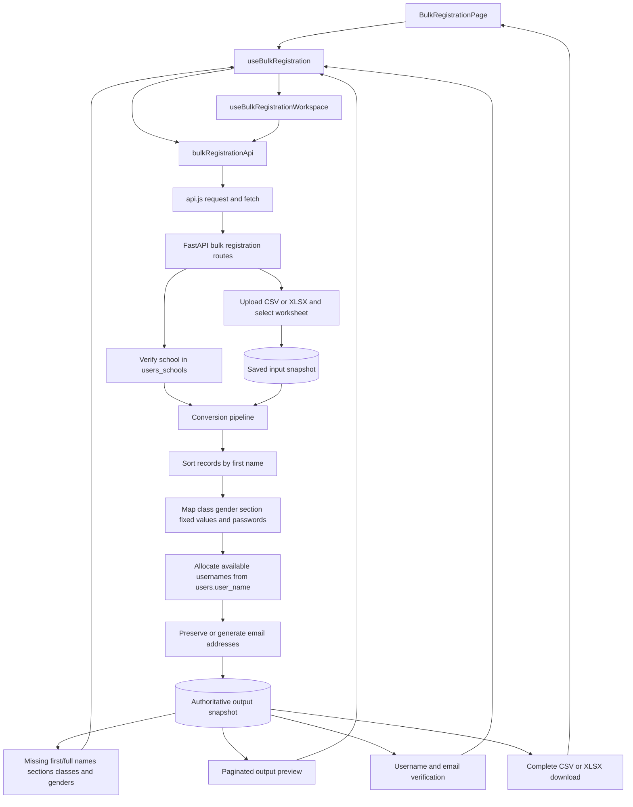

# Student Mapping

Current startup commands for the updated folders: [Run the project](backend/docs/RUNNING.md).

Architecture diagram tooling: [Archify commands](backend/docs/ARCHIFY.md).

A React and FastAPI application for mapping school records by admission number,
email, and full name plus class. The repository has two independently deployable
applications:

```text
python-api/
├── frontend/                 # React/Vite site
│   ├── src/
│   ├── e2e/
│   ├── .env.example
│   ├── package.json
│   └── README.md
└── backend/                  # FastAPI service
    ├── app/
    ├── tests/
    ├── docs/
    ├── .env.example
    ├── pyproject.toml
    ├── uv.lock
    └── README.md
```

The frontend folder contains everything needed for the website deployment. The
backend folder contains everything needed for the API deployment. FastAPI no
longer builds or serves the frontend.

## Features

- CSV/XLSX school and dump inputs up to 100 MB.
- Optional student dump retrieval from MySQL by school index.
- Admission, email, and full-name/class mapping stages.
- Matched, Review, and Not Matched result previews and individual downloads.
- Progressive multi-sheet **Download mapping results** workbook.
- Cookie-backed workflows with 24-hour inactivity expiry.
- Same-origin cross-tab synchronization through `BroadcastChannel`.
- Optimistic revision checks that reject stale concurrent changes.

## Local development

After dependency and environment setup, start both services with one command:

```powershell
Set-Location D:\python-api
powershell -NoProfile -ExecutionPolicy Bypass -File .\start-project.ps1
```

Keep that terminal open; Ctrl+C stops both services. The script uses local HTTP
settings without changing `.env` files and writes diagnostics to `logs/`.
If existing servers occupy the default ports, stop them first or use
`-BackendPort 8010 -FrontendPort 5180`. See the [startup guide](backend/docs/RUNNING.md).

For manual startup:

Use two PowerShell terminals. These commands assume the repository is located at
`D:\python-api`; adjust the path if needed. Dependency installation is needed on
first setup or after dependency updates. Existing `.env` files are preserved.

Start the backend:

```powershell
Set-Location D:\python-api\backend
if (-not (Test-Path .env)) { Copy-Item .env.example .env }
uv sync --locked
uv run python -m uvicorn app.main:app --reload --host 127.0.0.1 --port 8000
```

Start the frontend in another terminal:

```powershell
Set-Location D:\python-api\frontend
if (-not (Test-Path .env)) { Copy-Item .env.example .env }
npm ci
npm run dev
```

Local defaults use `http://127.0.0.1:5173` for the website and
`http://127.0.0.1:8000` for the API. For local HTTP only, set
`SESSION_COOKIE_SECURE=false` in `backend/.env`.

Open `http://127.0.0.1:5173/bulk-reg` for independent CSV/XLSX file intake with
drag-and-drop, file browsing, backend-local paths, and a preview. Path loading
requires `ALLOW_LOCAL_FILE_PATHS=true` in `backend/.env`. This page does not use
mapping state or submit registrations, and needs no additional server.

## Deploy on separate domains

Build the frontend with its public API origin:

```env
# frontend/.env.production
VITE_PRODUCTION_API_BASE_URL=https://api.example.com
VITE_API_PREFIX=/api/v1
```

Configure the backend with the exact frontend origin:

```env
# backend/.env
CORS_ORIGINS=https://app.example.com
SESSION_COOKIE_SECURE=true
SESSION_COOKIE_SAMESITE=lax
```

The frontend sends API requests with credentials. The backend therefore uses
explicit credentialed CORS and does not permit `CORS_ORIGINS=*`.

Using `app.example.com` and `api.example.com` is recommended. They are separate
origins but the same site, allowing the default `SameSite=lax` cookie policy. If
the two deployments use unrelated sites, set `SESSION_COOKIE_SAMESITE=none` and
keep HTTPS enabled; browser third-party-cookie policies can still prevent such a
session.

Deploy `frontend/dist/` to the frontend host and run the backend from its own
folder with:

```text
uv run python -m uvicorn app.main:app --host 0.0.0.0 --port <PORT>
```

The frontend host must rewrite client-side routes to `index.html`. The backend
deployment must persist `backend/storage/` so active workflows survive restarts.

## Workflow

1. Upload the school file.
2. Upload a student dump or fetch it from SQL using a school index.
3. Run admission mapping.
4. Optionally run email and full-name/class mapping.
5. Preview or download individual result groups.
6. Use **Download mapping results** in the sidebar to export every available group
   as a separate worksheet.

The final workbook is named
`automation-<school-index>-<school-name>.xlsx`. Admission adds three sheets,
Email adds two sheets, and Full Name + Class adds three sheets. Different matched
schemas are kept separate.

## Verification

```powershell
Set-Location D:\python-api\backend
uv run python -m unittest discover -s tests -p "test_*.py"

Set-Location D:\python-api\frontend
npm test
npm run build
```

See the [documentation index](backend/docs/README.md),
[backend setup](backend/README.md), [frontend setup](frontend/README.md),
[mapping workflow](backend/docs/MAPPING_WORKFLOW.md), and
[session/data flow](backend/docs/SESSION_AND_DATA_FLOW.md).

## Current code organization

Frontend HTTP requests are defined in `frontend/src/services`; the shared `request()`
function in `api.js` performs the actual `fetch()`. Mapping workspace state is composed
by `WorkspaceContext.jsx` from focused initialization, state, synchronization, mutation,
and metadata hooks. Backend endpoints live under `backend/app/routes`, shared HTTP/session
support under `backend/app/api`, business rules under `backend/app/services`, and SQL under
`backend/app/repositories`.

The platform tables `users`, `paid_users`, `users_schools`, and `users_sections` are
externally managed. See `backend/docs/EXTERNAL_DATABASE_SCHEMA.md` for the ownership
boundary and consumed columns.

## Bulk registration execution path

`/bulk-reg` uses a separate workspace from student mapping. The page calls
`useBulkRegistration`, which uses `bulkRegistrationApi` for school verification, file
intake, worksheet selection, preview conversion, pagination, username/email checks, and
downloads. FastAPI routes under `backend/app/routes/bulk_registration` delegate conversion
to `backend/app/services/bulk_registration.py`, database lookups to repositories, and
durable temporary state to `bulk_registration_storage.py`.

The generated preview is sorted by first name. Usernames are allocated from lowercase
first-name prefixes, blank emails become lowercase `username@schoolname.com` values after
school-name cleanup, and CSV/XLSX downloads use the complete saved output.

### Bulk registration flow



The bulk workflow proceeds as follows:

1. The browser restores or creates the independent cookie-selected bulk workspace.
2. The user verifies a numeric school index against `users_schools`.
3. One CSV/XLSX input is uploaded or loaded from an allowed backend path. XLSX inputs
   can select a worksheet, and the input preview is paginated independently.
4. Preview generation validates the saved revision, reads the complete input, sorts rows
   by lowercase first name with blanks last, and produces the fixed 24-column output.
5. Sections are matched against `users_sections`. Repeated first names receive successive
   available username suffixes from `001` through `1999` after checking `users.user_name`.
6. Existing nonblank emails are preserved. Blank values with a generated username become
   lowercase `username@schoolname.com` after removing spaces and punctuation from the
   school-name component.
7. The backend saves one authoritative output snapshot. Pagination returns 20-row slices,
   while verification and downloads always use the complete saved output.
8. Username verification checks preview duplicates, database duplicates, first-name
   prefix agreement, and blanks. Email verification checks preview duplicates, database
   duplicates, and blanks.
9. Clear file retains the workspace but removes input/output. Reset replaces the entire
   workspace. Revisions and cross-tab refresh prevent stale responses from restoring old
   data.

See [bulk registration conversion](backend/docs/BULK_REGISTRATION.md) for the detailed
module, sequence, conversion, username, email, verification, pagination, and reset
diagrams.
