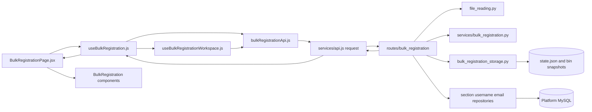
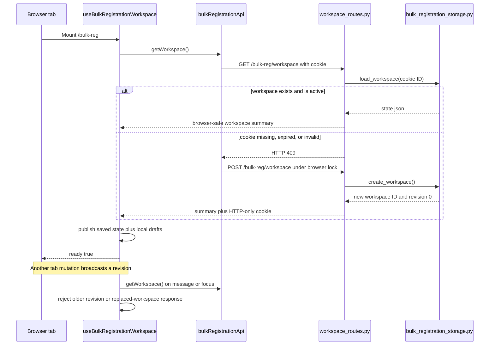
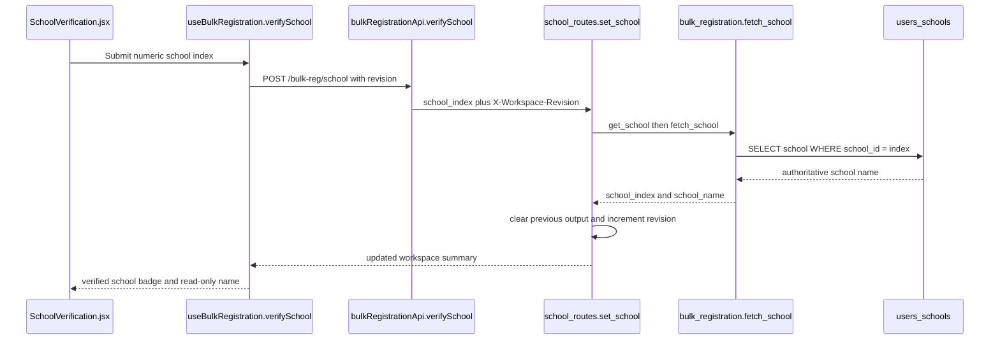
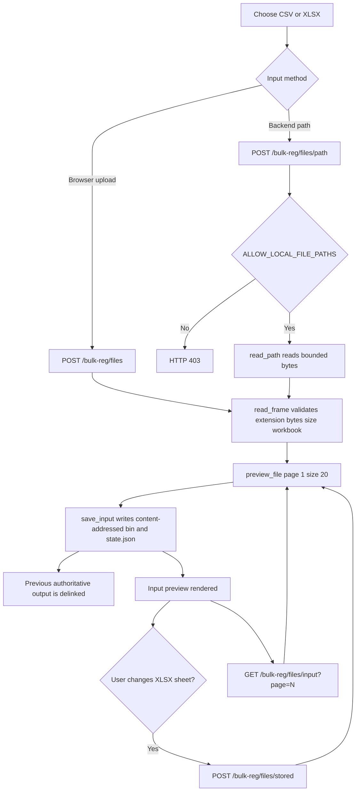
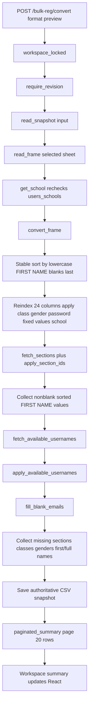
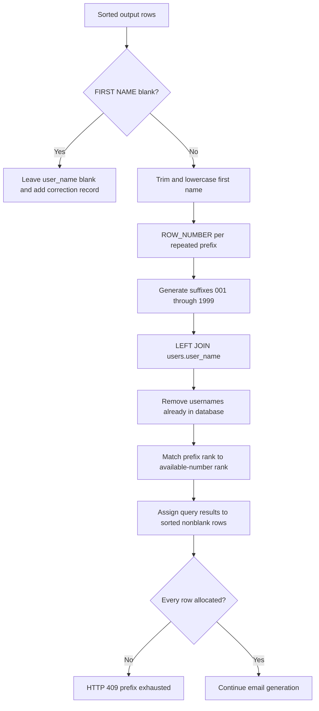
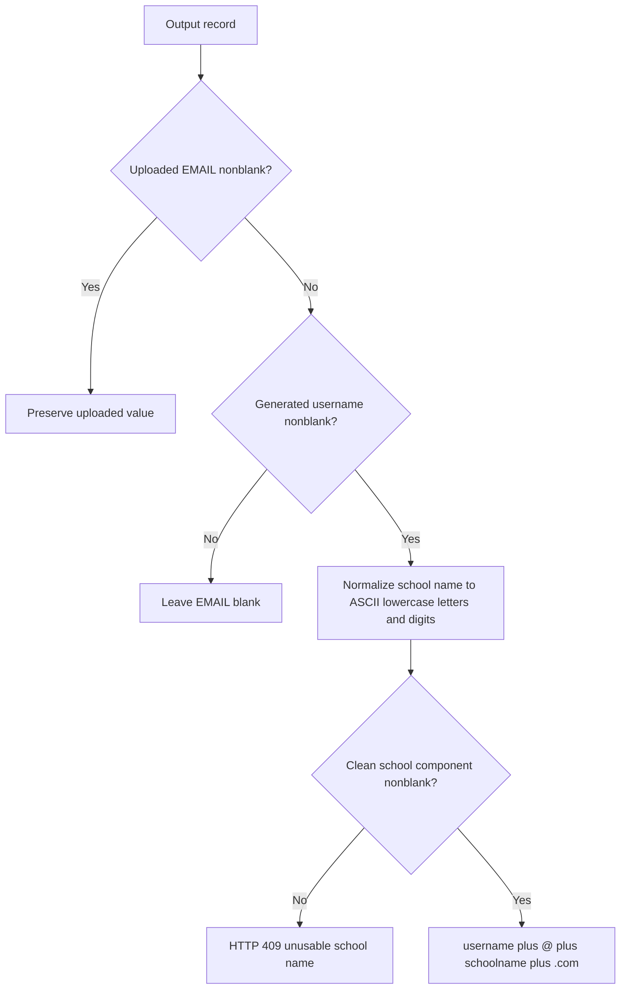
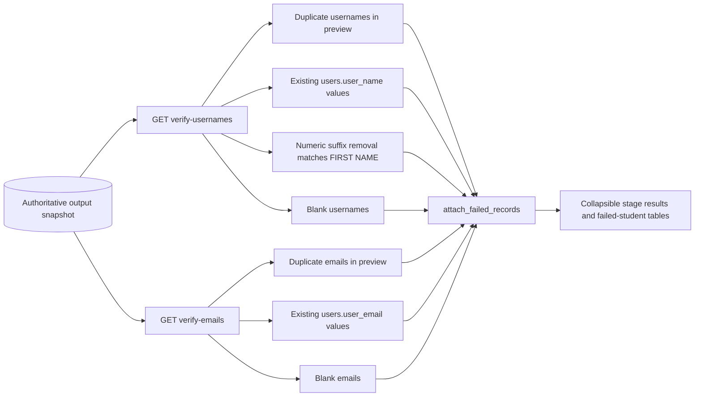
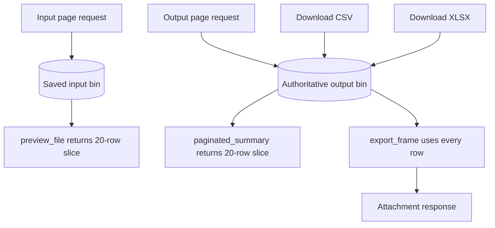
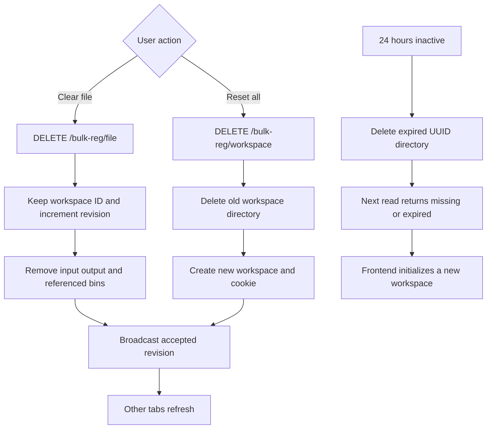

# Bulk registration conversion

Open `/bulk-reg` on the frontend. This service is independent of mapping state.
Its input and generated output files are stored as content-addressed `.bin`
snapshots under a dedicated bulk-registration workspace. Each workspace has a
`state.json` manifest linking the original filename, selected worksheet, school,
row count, and generated formats to those snapshots.
For startup commands, see [Run the project](RUNNING.md).

1. Enter the **School index** and select **Verify school index**. The service
   checks `users_schools.school_id` and retrieves `school`. On success it shows
   **School index verified** and a read-only **School name fetched** field.
   A missing index, unavailable database, or missing school name blocks conversion.
2. Upload or drop a CSV/XLSX file, or load a path on the backend computer.
   For XLSX, select **Working sheet** to choose the workbook tab. The first sheet
   is selected initially, including when it is empty, so another tab can be chosen.
   Input preview uses the selected sheet. Changing sheets synchronizes the selection
   across tabs but keeps the previous output. Only a successful **Generate preview**
   replaces that output in every tab; failed runs retain the previous results.
   Downloads use the worksheet that produced the displayed output, even if another
   sheet has since been selected. The output heading identifies its worksheet.
   CSV files have no worksheet selector. Empty sheets cannot be converted.
3. Select **Generate preview**, then **Download XLSX** or **Download CSV**.

The input headers must be a subset of these exact, case-sensitive headers. Every
download has all 24 headers in this order:

```text
FIRST NAME, LAST NAME, FULL NAME, Class Number, CLASS, Section, EMAIL,
PASSWORD, CONTACT, GENDER, Gender Number, Category, USER TYPE, SCHOOL,
School Number, user_subscription_date, user_package, user_activated,
user_subscribed, user_name, admission_number, house, section_index, year
```

Every output row receives the same Excel formula in `PASSWORD`:

```excel
=(RANDBETWEEN(1,9))&(RANDBETWEEN(0,9))&RANDBETWEEN(0,9)&RANDBETWEEN(0,9)&RANDBETWEEN(0,9)&RANDBETWEEN(1,9)
```

The password formula's digit rules are calculated once by the backend when the
preview is generated. That final six-digit value is stored in the authoritative
converted-output snapshot and reused as literal text by the preview, CSV, and
XLSX downloads, so a student's password remains identical in every format.

These values override input values on every row:

| Column | Value |
|---|---|
| Category | 0 |
| USER TYPE | Student |
| SCHOOL | School name fetched from the database |
| School Number | Entered school index |
| user_subscription_date | 2026-04-01 00:00:00 |
| user_package | 14 |
| user_activated | 1 |
| user_subscribed | 1 |
| year | 2026 |

Other input values are preserved; missing columns remain blank. `Gender Number`
is derived from `GENDER` (`Male` = 1, `Female` = 2, `Others` = 3). Rows are not
deduplicated. Identifiers stored as text retain leading zeros. Output preview is
paginated at 20 rows per page; exports include every row. No registrations are submitted.

Before saving the preview, records are sorted by `FIRST NAME` without regard to
capitalization, with blank first names last. Each nonblank first name is trimmed,
lowercased, and used as a username prefix. MySQL checks `users.user_name` and assigns
the first available numbered username from `001` through `1999`; repeated first
names receive successive available values. The resulting values replace `user_name`
in the preview and both downloads. Blank-first-name records retain a blank username
and appear in a warning table because a first name is required for username generation.

Uploaded nonblank `EMAIL` values are preserved exactly. After username allocation,
blank email values are generated as `username@schoolname.com`. Both the username
and school name are normalized to lowercase ASCII letters and digits, removing
spaces and punctuation and folding accented letters to ASCII. Only the separator
`@` and the dot in `.com` remain as punctuation. A row without a usable normalized
username keeps a blank email. The school name is validated for email generation
only when at least one blank email has a usable username.

Use **Verify emails** after generating output to run three checks across all saved
output rows: duplicate emails within the preview, and preview emails already in
`users.user_email`, and blank email values. Both generated and supplied emails are checked;
comparisons ignore surrounding whitespace and letter case. Each stage lists its
duplicates. The database lookup uses a parameterized `WHERE LOWER(TRIM(u.user_email)) IN (...)`
query. Verification results are cleared when the workspace revision changes.

Username verification also checks for blank usernames, for a total of four stages.
Both blank-value checks include empty strings, whitespace-only values, and nulls.
Their failed-record tables include every affected student. Verification counts
include all output rows; duplicate checks continue to compare nonblank values only.

Each failed username or email check offers **Preview students who failed**.
Expand it to see every matching student's complete output record, with a
one-based preview row number referring to the full generated output. Duplicate
checks include every student sharing the duplicate value. The username
first-name check includes only records whose own first name fails the check.

After preview generation, **Verify usernames** runs three checks against the saved
output: usernames must be unique within the preview, none may already exist in
`users.user_name`, and removing the trailing numeric suffix must reproduce the
lowercase first name. The database check uses a parameterized `IN` lookup and the
UI reports each stage independently as passed or failed.

`CLASS` is derived from the class name in `Class Number`: Class I-XII map to 0-11, followed by
Other = 12, Nursery = 13, LKG = 14, UKG = 15, Passed Out = 16, KG = 17,
Pre Nursery = 18, Pre Primary = 19, Pre School = 20, and Play Group = 21.

Every distinct nonblank `Section` is checked against `users_sections.section`.
Matching ignores capitalization, repeated spaces, and surrounding spaces. A match
writes its `section_id` into `section_index`. The preview lists missing sections in
a warning table with the affected student's full name and original spreadsheet row
number so they can be corrected or inserted into `users_sections`; their
`section_index` remains blank until the database contains them.

The verified index and fetched name override school values in every input row.
Changing the index clears verification, fetched name, preview, and downloads.
A working database is required, but mapping state is not used. Conversion and
download recheck school identity in the database and read the original upload or
local path again; preview a changed local file again to review its latest contents.

API endpoints (under the configured API prefix, normally `/api/v1`):

- `GET /bulk-reg/workspace`: read the cookie-selected workspace. Missing or
  expired workspaces return HTTP 409 without changing the cookie.
- `POST /bulk-reg/workspace`: initialize or restore the cookie-selected workspace
  and return its complete browser-safe summary. The browser serializes this
  operation with reset and rechecks the current cookie before initializing.
- `POST /bulk-reg/files`: input preview from multipart `file` and optional `sheet`.
- `POST /bulk-reg/files/path`: input preview from JSON `path` and optional `sheet`.
- `POST /bulk-reg/files/stored`: change the selected worksheet of the saved input.
- `POST /bulk-reg/school`: verify and save a school index.
- `GET /bulk-reg/schools/{school_index}`: verify index and fetch school name.
- `POST /bulk-reg/convert`: multipart `school_index`, `file_format`
  (`preview`, `csv`, or `xlsx`), optional `sheet`, and preview `page`.
- `DELETE /bulk-reg/file`: clear input/output references while retaining the workspace.
- `DELETE /bulk-reg/workspace`: explicitly reset and replace the whole workspace.

Every mutation except initialization requires `X-Workspace-Revision`.
A stale revision returns HTTP 409. Delayed reads and mutations cannot create a
replacement workspace; only explicit initialization or reset can set its cookie.
Complete workspace operations, including snapshot reads, are serialized within
the single-worker server so concurrent requests cannot commit the same revision.

Local paths require `ALLOW_LOCAL_FILE_PATHS=true`.

## Cross-tab workspace

Bulk registration has its own backend workspace, separate from mapping. An
HTTP-only cookie identifies it. React keeps only the current in-memory API summary;
neither localStorage nor IndexedDB is used. On refresh, React fetches the complete
summary from `GET /bulk-reg/workspace`. The backend `.bin` snapshot is reused
for page requests and downloads. Downloads occur only in the requesting tab.
Busy indicators and errors are local to each tab.
Unsubmitted school-index and path edits are also local to each tab. Focus refresh
preserves those drafts; successful verification or file loading commits the
corresponding field. Reload discards drafts, and a workspace reset clears them.

BroadcastChannel announces successful state replacement and focus refresh is the
fallback. Backend revision checks reject delayed API results when another tab has
already changed the workspace. The browser also rejects older responses and
responses from a workspace that has since been reset. No mapping session or
mapping API is used.

Bulk workspaces expire after 24 hours without API activity. Valid workspace reads
refresh the activity timestamp. Expiry removes `state.json` and every referenced
`.bin` file; the next request creates a new empty workspace. Before expiry, the
workspace persists after leaving the page or closing tabs. **Clear file**
opens a confirmation overlay; **Confirm** removes the source and output across
tabs, while **Cancel** or Escape leaves them unchanged. **Reset bulk registration** clears the
whole bulk workspace across tabs. Browser site-data deletion also clears it.
Different browsers, profiles, hostnames, or ports do not share this workspace.
Site storage must be available; storage errors are displayed rather than silently
continuing with an unsaved workspace.

## Frontend organization

`BulkRegistrationPage.jsx` composes the layout. `useBulkRegistration.js` owns
file loading, school verification, worksheet changes, conversion, and downloads.
The `components/` folder contains `SchoolVerification`, `RegistrationFileInput`,
`RegistrationDefaults`, `RegistrationActions`, and `RegistrationPreviews`.
`useBulkRegistrationWorkspace.js` remains responsible for persistence and tab sync.

## Current frontend and backend ownership

`frontend/src/services/bulkRegistrationApi.js` defines the bulk HTTP calls;
`useBulkRegistrationWorkspace` owns workspace restoration/synchronization and
`pages/BulkRegistration/useBulkRegistration.js` owns page actions. Backend decorators
are grouped under `app/routes/bulk_registration`, conversion rules live in
`app/services/bulk_registration.py` and `app/mappings/bulk_registration`, and database
lookups remain in repositories.

The full schema of platform-owned lookup tables is intentionally not duplicated here.
See [External database contract](EXTERNAL_DATABASE_SCHEMA.md).

## End-to-end execution flow

1. `BulkRegistrationPage.jsx` renders the feature and calls
   `useBulkRegistration()`. `useBulkRegistrationWorkspace()` restores the independent
   cookie-selected workspace through `bulkRegistrationApi.getWorkspace()`.
2. `bulkRegistrationApi.js` passes requests to the shared `request()` transport in
   `frontend/src/services/api.js`. Uploads use `FormData`; mutations include the current
   `X-Workspace-Revision`.
3. Route modules under `backend/app/routes/bulk_registration` validate the request,
   resolve the cookie workspace, enforce its revision, and delegate file parsing,
   conversion, persistence, and database lookup work.
4. `convert_workspace_file()` reads the saved input snapshot and calls
   `convert_frame()`. The frame is sorted by first name, fixed values are applied,
   sections are resolved, usernames are allocated, and blank emails are generated.
5. `fetch_available_usernames()` allocates the first unused numbered username for each
   lowercase first-name prefix. Repeated names receive successive available values from
   the database query result. Rows with blank first names remain unallocated and are
   returned with source row numbers for correction.
6. `fill_blank_emails()` preserves uploaded nonblank email values. For blank values with
   a generated username, it removes spaces and punctuation from the school name and
   creates a lowercase `username@schoolname.com` address.
7. The authoritative output is saved as a backend snapshot. Input and output previews
   request individual pages; CSV and XLSX downloads always use the complete authoritative
   frame rather than the visible page.
8. `verify_output_usernames()` checks preview duplicates, database duplicates,
   first-name/prefix agreement, and blanks. `verify_output_email_addresses()` checks
   preview duplicates, database duplicates, and blanks. Failed stages include complete
   student records so the UI can display the affected rows.

```text
BulkRegistrationPage
    -> useBulkRegistration
    -> bulkRegistrationApi
    -> shared request and fetch
    -> FastAPI bulk registration route
    -> conversion service and mapping rules
    -> repository SQL and snapshot storage
    -> workspace summary or file response
    -> hook state replacement
    -> preview verification or download UI
```

## Repository-backed detailed flows

The diagrams below use the current filenames and function names. They describe the web
workflow implemented by the repository, not a proposed design.

### 1. Module and request ownership



`BulkRegistrationPage.jsx` only composes sections. `useBulkRegistration.js` owns user
operations, busy/error state, pagination requests, and revision-bound verification
results. `useBulkRegistrationWorkspace.js` owns saved state, local drafts, stale-read
protection, focus refresh, and BroadcastChannel updates.

### 2. Workspace restoration and cross-tab synchronization



The hook keeps path and school-index drafts only in memory. Reloading discards drafts.
The backend manifest and snapshots survive navigation until reset or 24-hour inactivity
expiry.

### 3. School verification



Changing the school-index input in React immediately clears the local verified school and
output. The backend rechecks the school during conversion and download; a saved preview
cannot be downloaded under a different school index.

### 4. File upload, local path, worksheet selection, and input pages



CSV files have no worksheet selector. XLSX worksheet changes update the stored input
metadata and invalidate output. Input pagination always reads the saved input snapshot;
it does not resend the file from the browser.

### 5. Preview conversion pipeline



`convert_frame()` records each original spreadsheet row number before sorting. Warning
tables therefore identify the original source row even though output is sorted by first
name.

### 6. Username allocation for unique and duplicate first names



For two students named `aditya`, the prefix rows receive ranks 1 and 2. If `aditya001`
and `aditya003` already exist, the first two available results are `aditya002` and
`aditya004`. The query result order is aligned with the sorted output rows by
`apply_available_usernames()`.

### 7. Email generation



The same `_email_component()` cleanup is applied to the generated username and school
component. Uploaded nonblank email text is not rewritten during generation; explicit
verification normalizes it for comparison.

### 8. Username and email verification



Verification never checks only the visible page. Both endpoints reload the complete
authoritative snapshot. React stores each result with `workspace_id:revision`; after a
new conversion or reset, an old result is no longer displayed.

### 9. Pagination and downloads



Changing a page only replaces the visible summary in the browser. CSV and XLSX generation
reads every saved output row. XLSX uses write-only cells containing literal strings so
identifiers, passwords, and leading zeros are preserved.

### 10. Clear file, reset workspace, and expiry



All route operations that use snapshots run under `workspace_locked()`. This prevents a
writer from deleting a referenced binary while a reader is still using it in the
supported single-worker deployment.
