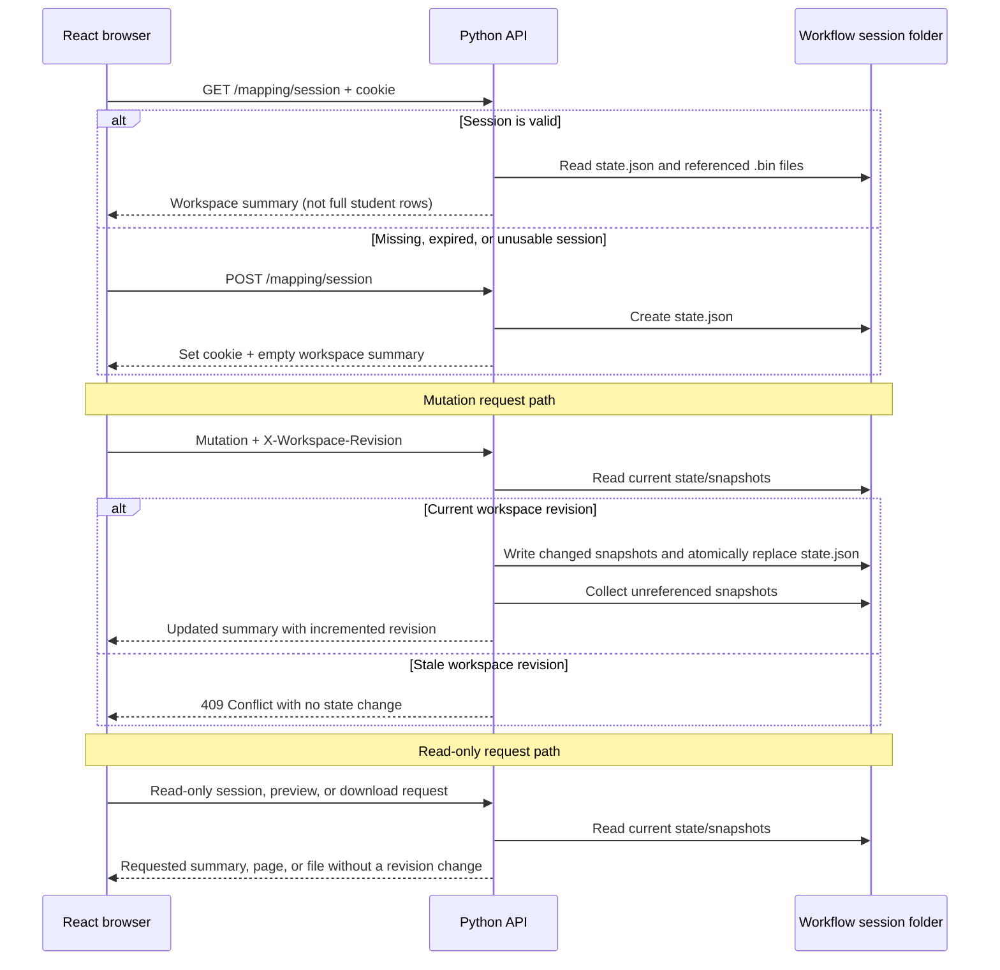
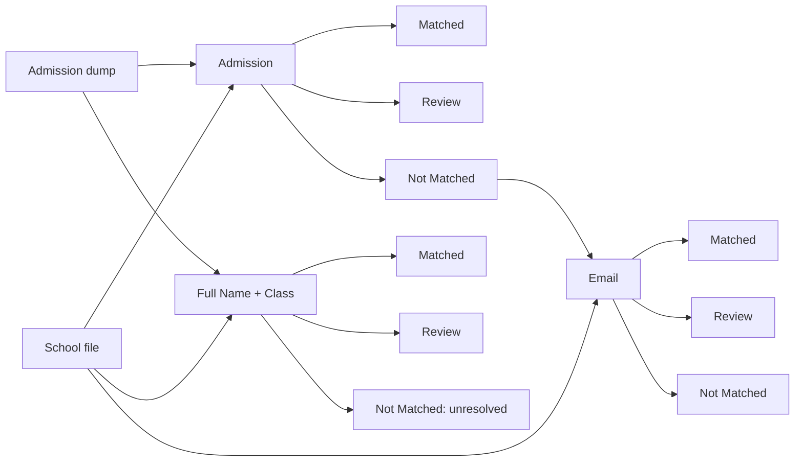

# Student mapping workflow

Current startup commands for the updated folders: [Run the project](RUNNING.md).

## Clear loaded files

Use **Clear file** beside a loaded school input or student dump, or on its file
viewer page, then **Confirm** in the overlay. **Cancel** or Escape keeps the file
and results unchanged. SQL-fetched dumps can also be cleared. Clearing removes the workspace
snapshot, not the original disk file or database records. Clearing school or dump
inputs invalidates admission, email, and full-name/class results and the generated
email dump. Clearing only the email dump preserves admission results and clears
email and full-name/class results. Changes synchronize across mapping tabs and
use the existing workspace revision checks. Files can be loaded again afterward.

The workspace maps school records to existing accounts through three independent mappings:
**Admission Number**, **Email**, and **Full Name + Class**. A stage runs only when
its mapping button is clicked; navigation, refresh, column selection, searching,
and pagination never run mapping automatically.

**Terminology:** `Matched` passed the current stage; `Review` (shown as **Review
students**) needs attention; `Not Matched` may continue to the next stage. A
**Preview screen** only displays/downloads a result group—it is not another
classification. Status cells include the reason, for example
`Matched — Email and first name match`.

For cookie, session-folder, `state.json`, snapshot, and React-cache details, see
[Session and data flow](SESSION_AND_DATA_FLOW.md). Implementation entry points
are in [CODE_FLOW.md](CODE_FLOW.md).

## Session and API startup

The browser sends the HTTP-only workflow cookie with `credentials: "include"`;
the session ID is never placed in API URLs.

| Request | Purpose |
|---|---|
| `GET /api/v1/mapping/session` | Restore the cookie's unexpired session and return its UI summary. |
| `POST /api/v1/mapping/session` | Create a session and set the cookie when GET finds no usable session. |
| `POST /api/v1/mapping/configuration-preview` | Validate draft selections without committing them. |

Every mutation request also sends the summary's current revision in the
`X-Workspace-Revision` header. A stale revision returns HTTP 409 without changing
the workspace. GET previews, downloads and session restoration are read-only with
respect to logical state and do not advance that revision.

When a mutation succeeds, its tab publishes `workspace-changed` through the
`student-mapping-workspace` `BroadcastChannel`. Another tab sharing the cookie
reloads `GET /session` and applies the summary only if the workspace ID or revision
changed. Focus and visibility events provide a fallback refresh. The notification
does not carry workspace data or credentials, and backend revision validation still
prevents stale writes.



Email and class-mapping source metadata is cached in React while its source,
worksheet, results, and relevant settings are unchanged. Failed requests are not
cached; refresh clears this memory cache. Admission, Email, and Full Name + Class
can be started when their own required files are available. Changing the school
file, dump file, or school index clears all results. Rerunning Admission clears
Email and Class results; rerunning Email clears Class results.

### Storage and input files

| Location | Responsibility |
|---|---|
| HTTP-only cookie | Carries the opaque workflow session ID. |
| Browser `sessionStorage` | Remembers Preview preferences and uncommitted mapping drafts for the tab; workspace/source-version keys prevent stale draft reuse. |
| Browser `BroadcastChannel` | Notifies other same-origin tabs that the shared workspace changed; it carries only `workspace-changed`. |
| Session `state.json` | Manifest of workspace identity, revision, settings, metadata, and references to snapshots. |
| Session `.bin` files | Content-addressed bytes for CSV/XLSX inputs and generated workbooks. |
| React context cache | Avoids repeated metadata calls until a dependency changes or the page refreshes. |

School and Dump accept CSV/XLSX upload; local-path loading supports the same
formats only when `ALLOW_LOCAL_FILE_PATHS` is enabled. Both input methods enforce
`MAX_UPLOAD_BYTES`, which defaults to **100 MB** (`104857600` bytes), against the
complete file. There is no separate row-count limit. XLSX files expose worksheet
selection. Dump can alternatively be fetched from SQL by numeric school index;
SQL-fetched dumps are database results and do not use the file-upload size limit.
SQL fetches select school students with an inner `JOIN` to paid admission records.
Students without a paid record are excluded. See [selection and counts](#sql-dump-selection-and-counts).
For SQL dumps, missing cells become empty text and records that are completely
identical after normalization are stored once. A failed lookup preserves the
currently loaded dump and results; replacement occurs only after a successful fetch.
Replacing an input creates/reuses its content-hash snapshot and invalidates
dependent results; it never edits the original uploaded file.

`state.json` is the logical source of truth: it identifies which hash-named
`.bin` belongs to each input and result. Unchanged bytes reuse their snapshot;
changed bytes create a new hash and the manifest link moves to it. After the new
manifest is published, the old **delinked** snapshot and abandoned pending files
are garbage-collected. After 24 hours of inactivity, the complete remaining
session folder is removed.

### SQL dump selection and counts

`backend/app/repositories/admission_dump_service.py` implements the SQL fetch:

1. Validate a numeric school index and look up a nonempty school name in
   `users_schools`. An unknown school causes an error.
2. Select `users` with `user_edu_school = :school_index` and `user_type = '0'`.
   Non-student users and users with a NULL type are excluded.
3. `JOIN paid_users` on `user_id` to attach admission numbers. Students with no
   paid record are excluded.
4. SQL `DISTINCT` removes duplicate selected records. Convert SQL NULL cells to
   empty text and remove rows that then become completely identical. Identifiers
   stay text, including leading zeros. The validity check trims admission text;
   it does not rewrite the stored admission value.

| Paid records for one selected student | Dump result |
|---|---|
| No paid record | Excluded by the inner join |
| `001` | One row with `001` |
| `002`, `002` | One row with `002` |
| NULL, empty text, `003` | Distinct joined rows are retained, then exact normalized duplicates are removed |
| `004`, `005` | Two rows for the same student |
| NULL, empty text only | One blank row after normalization if the selected rows become identical |
| NULL, empty text, spaces-only text, literal `null` | Can retain several rows because these values are not all normalized to empty text |

Multiple distinct admissions are retained; the fetch does not select a first or
latest paid record, combine admissions, or introduce a conflict flag.

The student population to compare against is:

```sql
SELECT COUNT(*)
FROM users
WHERE user_edu_school = :school_index
  AND user_type = '0';
```

Assuming `users.user_id` uniquely identifies each user, the dump's distinct
student count represents this population at fetch time. **Dump records** and the
fetch message count retained rows; **Students** counts distinct user IDs. Row
count can exceed student count when one user has multiple retained admissions
or different missing-value representations. Counting all users for the school
without the student-type filter is a different comparison.

These rules apply to SQL fetches. Uploaded CSV/XLSX dumps are not automatically
reconciled against the database. A saved dump is a snapshot; database changes do
not appear until another fetch. Existing saved dumps must be fetched again to
include students that the previous inner join omitted.
See [Snapshot linking, updates and cleanup](SESSION_AND_DATA_FLOW.md#3-snapshot-linking-updates-and-cleanup)
for examples and failure behavior.

## Pipeline and forwarding



- Email can read either the original school file or Admission **Not Matched**.
  The school-file option is independent; the Admission option requires a saved
  Admission run. Full Name + Class reads the original school file directly.
- Review rows remain in their originating workbook. Read-only previews mean that
  corrections require input changes and a rerun.
- Final misses have no further automatic stage or account creation.

## 1. Admission Number mapping

Inputs are the selected school and admission-dump worksheets. Required school
admission/name and dump admission/username/first-name columns must exist. Reserved
result-column names in the school file are rejected.

Completely identical school rows are deduplicated first; the first copy is kept
and dropped copies are counted, not classified as Review.

| Condition, in order | Result |
|---|---|
| School admission is blank | Review |
| Nonblank admission repeats in retained school rows | Every occurrence → Review |
| School first name is missing | Review |
| No dump row has the admission | Not Matched |
| Multiple dump rows have it | Review; select no account |
| One dump row but first name is missing/different | Review |
| Names match but dump username is blank | Review |
| Unique admission, equal first name, username present | Matched; copy username/user ID, subject to uniqueness |

Admission numbers are trimmed text (`00123` differs from `123`). First names are
trimmed/lowercased, and the web workflow compares the whole selected cell. Only
the CLI's optional `--full-name-column` extracts the first word. Dump evidence
counts the header as row 1. A nonblank user ID is not required.

Thus blank admissions and missing school first names are Review. Admission Not
Matched specifically means a unique, nonblank admission with a present school
first name was absent from the dump.

## 2. Email mapping

The Email input selector offers the selected school worksheet or Admission
**Not Matched**. The school-file option does not require Admission mapping. If
Admission **Not Matched** is selected before Admission has run, the UI and API
instruct the user to run Admission mapping first. A separate SQL lookup fetches the selected
emails across all schools; it neither uses nor replaces the admission dump and
needs no school confirmation. Requested emails and identical returned rows are
deduplicated.

| Condition, in order | Result |
|---|---|
| Email blank after trimming | Not Matched — `Email missing` |
| Normalized email repeats in input | Every occurrence → Review, even if SQL found none |
| Multiple fetched records own email | Review; select no account |
| One candidate and first names match with more than one character | Matched, subject to school and account uniqueness checks |
| One candidate and matching first name is only one character (ignoring periods) | Review — `First name matches but is only 1 character` |
| One candidate but a first name is missing/different | Review; retain account evidence |
| Unique nonblank input email has no candidate | Not Matched — `Email not found` |

Emails and first names are trimmed and lowercased. The selected school first-name
column is compared directly with dump `user_firstname`; there is no fuzzy or
full-name comparison. Matching one-character names, including initials
such as `A.`, remain in Review. A successful name match must also pass the school
and account-uniqueness checks. Email misses normally continue, and the lookup is
saved as `email_dump.csv`.

## 3. Full Name + Class mapping

This uses the original school file plus the saved admission dump—not the email
dump. Admission and Email results are not prerequisites. Required school/dump columns must exist. Dump rows remain eligible when
their admission number is blank; matching is based on name and class in this
mapping. It runs only when **Run mapping** is clicked.

### Concatenated key

The source key is lowercased, trimmed full name with literal spaces removed plus
trimmed/lowercased Class Number: `Alice Smith` + `3` → `alicesmith3`. It is
compared with dump `generated_col`.

| Condition | Result |
|---|---|
| Source name or class missing | Not Matched with specific reason |
| Key occurs multiple times in dump | Review |
| Key occurs once | Matched; copy username/user ID, subject to uniqueness |
| Key absent | Not Matched |

SQL `generated_col` uses name plus package-adjusted class: package **14** uses
`user_edu_class`, **12** adds 1, **11** adds 2, and others use stored class.
Uploaded dumps must provide a compatible column. The mapping does not numerically
normalize source class (`3` differs from `3.0`); dump-browser display offsets are
separate from this rule.

## Account uniqueness and reconciliation

Each stage rejects a shared nonblank **username OR user ID** among candidate
matches. Identifiers are trimmed, case-sensitive text; blanks are ignored. Every
row sharing either identifier moves to Review with evidence retained.

Automatic runs check uniqueness within their own mapping. Upstream reruns clear
downstream workbooks rather than reclassifying them. The obsolete cross-stage
reconciliation endpoint has been removed.

## Results, previews, and invalidation

| Stage | Matched | Review | Not Matched / next input |
|---|---|---|---|
| Admission | `matched.xlsx` | `review.xlsx` | `not_matched.xlsx` → Email/direct final |
| Email | `email_matched.xlsx` | `email_review.xlsx` | `email_not_matched.xlsx` → final |
| Full Name + Class | `full_name_class_matched.xlsx` | `full_name_class_review.xlsx` | `full_name_class_not_matched.xlsx` → unresolved |

Every run writes three XLSX files, with headers even when empty. They contain
school fields, evidence, account fields, and status/reason. Each mapping reads the
school file directly. No combined master workbook is produced.

Result previews paginate and download Excel/CSV (UTF-8 BOM):
`GET /api/v1/mapping/result-previews/{stage}/{filename}?page=1&limit=50`.
They are read-only; the former Admission move API returns HTTP 403.

Invalidation follows dependencies:

- School file, dump file, or school-index changes clear all mapping results.
- Rerunning Admission clears Email and Full Name + Class results.
- Rerunning Email clears Full Name + Class results.
- Rerunning Full Name + Class replaces only its own results.
- Mapping/reconciliation rebuild only affected workbooks.

Original uploads remain separate. SQL admission fetch saves
`school_<index>_dump.csv`; Email saves `email_dump.csv`.

## School and dump browsing: data and pagination

Shared frontend `FileViewer` requests only the displayed student page:

| Page | API |
|---|---|
| School | `GET /api/v1/mapping/table-previews/school` |
| Dump | `GET /api/v1/mapping/table-previews/dump` |

`fileApi.table` sends the cookie and optional parameters:

| Parameter | Meaning |
|---|---|
| `page`, `limit` | One-based page and size; UI offers 25/50/100, default 50. |
| `sheet` | Selected Excel worksheet. |
| `query` | Case-insensitive literal search (not regex). |
| `columns` | Repeated selected search columns; omitted means all. Multiple use OR. |
| `class_column`, `section_column` | School-only statistics columns. |

```text
GET /api/v1/mapping/table-previews/school?page=2&limit=25&query=alice&columns=FIRST%20NAME&columns=Email
```

Opening a viewer or changing page, size, sheet, search, columns, or statistics
columns requests data. Filter/size changes reset page 1. `AbortController`
cancels obsolete requests; the current request shows `Reading file...`.

Backend `table_view` in
`backend/app/routes/file_workflow_routes/source_files_preview.py` validates the
cookie/session and columns, reads the saved snapshot/worksheet, filters the full
DataFrame, clamps the page, and returns only that slice. Response fields are
`columns`, current-page `rows`, unfiltered `total`, filtered `found`, `page`,
`pages`, `offset`, and `end`. Dump also returns overview, distinct student count,
inferred school index, and `generated_col` availability; School returns its
class/section overview when configured.

The `.bin` used here is the saved School/Dump source, not a search cache. Search
results are temporary and create no snapshot.

Statistics use the full saved source, but only the current student page crosses
HTTP. Browsing/searching never changes files or reruns mapping.

## Production reference

### Main API surface

All workflow routes below require the session cookie except session creation and
the health check.

| Method and path | Responsibility |
|---|---|
| `GET /` or `GET /api/v1/mapping/health` | Service health response. |
| `POST /api/v1/mapping/files/{school|dump}` | Upload CSV/XLSX input. |
| `POST /api/v1/mapping/files/{kind}/path` | Load an allowed server-local CSV/XLSX path. |
| `POST /api/v1/mapping/student-dump/fetch` | Fetch school dump from SQL. |
| `POST .../admission-mapping/run` | Run Admission mapping. |
| `POST .../email-mapping/run` | Run Email mapping from the selected school-file or Admission Not-matched source. |
| `POST .../full-name-class-mapping/run` | Run Full Name + Class from the school file. |
| `GET .../table-previews/{kind}` | Read paginated source data. |
| `GET .../result-previews/{stage}/{filename}` | Read paginated results. |
| `GET .../downloads/{kind}` | Download source/result as supported CSV/XLSX. |

`...` means `/api/v1/mapping`. Request and response models remain authoritative
in the FastAPI/OpenAPI schema.

## How workflow snapshot storage works

### 1. Creating a `.bin` snapshot

When the backend saves a source file or generated workbook:

```text
File bytes
    ↓
Calculate SHA-256 hash
    ↓
Use hash as filename
    ↓
<hash>.bin
```

Example:

```text
school.csv bytes
    ↓
SHA-256: a4cc240411d6...
    ↓
a4cc240411d6....bin
```

The `.bin` file contains the original bytes:

- Uploaded CSV bytes
- Uploaded XLSX bytes
- SQL-generated CSV bytes
- Generated result-workbook bytes

The `.bin` extension does not mean the data was converted into a custom format.

### 2. Linking from `state.json`

`state.json` stores metadata and the snapshot filename:

```json
{
  "saved_admission_school": {
    "metadata": {
      "name": "school.csv",
      "source": "school.csv"
    },
    "file": "a4cc240411d6....bin"
  }
}
```

Conceptually:

```text
state.json
    │
    ├── saved_admission_school
    │        └── school-hash.bin
    │
    ├── saved_admission_dump
    │        └── dump-hash.bin
    │
    └── admission_exports
             ├── matched.xlsx     → matched-hash.bin
             ├── review.xlsx      → review-hash.bin
             └── not_matched.xlsx → unmatched-hash.bin
```

`state.json` gives meaning to each `.bin` file. Without the manifest, the hash filename alone does not indicate whether it contains a school file, Dump, or result workbook.

### 3. Updating a file

When the bytes change:

```text
Old bytes → old hash → old-hash.bin
New bytes → new hash → new-hash.bin
```

The backend:

1. Writes the new `.bin` snapshot.
2. Updates `state.json` to point to it.
3. Atomically publishes the new `state.json`.

```text
Before:
state.json → old-hash.bin

After:
state.json → new-hash.bin
```

If the bytes are unchanged, the hash is unchanged, so the existing `.bin` file is reused.

### 4. Updating one result group

The entire session folder is not replaced.

For example, if only `matched.xlsx` changes:

```text
Before:
matched.xlsx     → hash-A.bin
review.xlsx      → hash-B.bin
not_matched.xlsx → hash-C.bin

After:
matched.xlsx     → hash-D.bin
review.xlsx      → hash-B.bin
not_matched.xlsx → hash-C.bin
```

Unchanged result bytes keep the same hash reference.

### 5. Delinking a file

A `.bin` file becomes delinked when its reference is removed from `state.json`.

For example, rerunning Admission clears Email results:

```text
Before:
state.json
  ├── admission_exports
  └── email_exports → email-result.bin

After:
state.json
  └── admission_exports
```

The Email result becomes inaccessible as soon as the published `state.json` no
longer references it. The post-publication garbage collector then removes its
unreferenced `.bin` file.

> [!IMPORTANT]
> Garbage collection runs only after the replacement manifest is safely published.
> It removes unreferenced `.bin` snapshots and abandoned `.pending` files. The
> complete workflow folder is still deleted after 24 hours of inactivity.

### 6. Loading a snapshot

When the backend needs a source or result:

```text
Read state.json
      ↓
Find logical entry
      ↓
Read referenced hash.bin
      ↓
Restore original filename and metadata
      ↓
Parse CSV/XLSX or return workbook bytes
```

If the `.bin` reference is missing or invalid, the backend now returns `409 Conflict`.

### 7. Session expiry

After 24 hours of inactivity:

```text
workflow_sessions/<session-id>/
    ├── state.json
    ├── source-hash.bin
    ├── dump-hash.bin
    └── result-hash.bin
              ↓
       Entire folder deleted
```

### 8. BroadcastChannel API and cross-tab synchronization

Tabs opened on the same origin share the HTTP-only workflow cookie, so they point
to the same backend session. Their React state, metadata cache, and
`sessionStorage` remain independent until each tab refreshes its own session
summary.

After a successful upload, settings change, dump fetch, or mapping run, the tab
that performed the operation sends `workspace-changed` through a browser
`BroadcastChannel` named `student-mapping-workspace`. The message contains no
student data, session identifier, cookie, or workspace state. It only asks other
tabs to fetch the authoritative summary from `GET /session`.

An idle receiving tab compares the returned `workspace_id` and `revision` with its
current values. It replaces its workspace state only when that fingerprint changed
and displays a notice asking the user to review the updated selections. A tab does
not interrupt an operation already in progress to apply a channel notification.

Cross-tab responsibilities are separated as follows:

| Module | Responsibility |
|---|---|
| `frontend/src/services/cross-tab-broadcast-channel.js` | Creates the channel, filters messages, publishes changes, provides the unsupported-browser fallback, and closes the channel. |
| `frontend/src/hooks/useCrossTabWorkspaceUpdates.js` | Subscribes during the React lifecycle and refreshes when the tab becomes focused or visible. |
| `frontend/src/context/WorkspaceContext.jsx` | Announces successful mutations, reloads session state, and applies changed workspace summaries. |

Focus and visibility refreshes provide a fallback when `BroadcastChannel` is
unsupported or a message is missed. Cross-tab notification improves update speed;
it is not the concurrency guarantee. Every mutation still includes
`X-Workspace-Revision`, and the backend returns `409 Conflict` before applying a
stale write.

Session expiry is independent of this browser API. A channel message cannot restore
a deleted or expired backend session; the normal session recovery flow creates a
new session instead.

### 9. Final mapping-results workbook

After any mapping produces its result groups, the sidebar **Exports** section enables
**Download mapping results**. This position keeps the combined workbook separate
from downloads for an individual preview group.
`GET /api/v1/mapping/downloads/final-results` resolves the currently
available snapshots referenced by session state and returns
`automation-<school-index>-<school-name>.xlsx`. Characters that are unsafe in a
download filename are replaced. If the saved dump has no school name, the school
input filename stem is used as a fallback. Sheets are added progressively:

1. Admission adds `Admission Matched`, `Admission Review`, and `Admission Not Matched`.
2. Email adds `Email Matched` and `Email Review`.
3. Full Name + Class adds `Class Matched`, `Class Review`, and `Final Not Matched`.

The matched schemas are deliberately not concatenated. Each sheet preserves the
columns generated by its own mapping stage. An available stage's empty result groups
remain present as header-only sheets.
