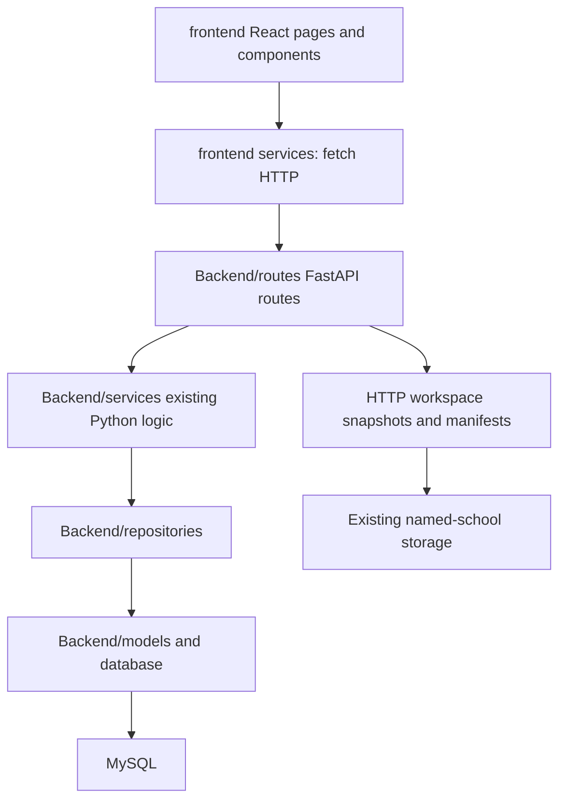

# Following the React and Python workflows

`frontend/` is the React frontend and `Backend/` is the FastAPI backend. Python
matching algorithms, SQL repositories, ORM and serialization remain the source of
business behavior. [README.md](../README.md) contains the current source tree,
endpoint list, run commands and verification limits.

## Startup and dependency direction

From the root, activate `.venv` and run `uvicorn Backend.main:app --reload --reload-dir Backend`. In another
terminal run `cd frontend`, `npm install`, then `npm run dev`. Open port 5173.

`Backend/main.py` retains `app` and `create_app()`, registers health/student browsing
plus `file_workflows`, and adds configured CORS. Mapping responses disable caching,
carry `X-Request-ID` and `Server-Timing`, and emit method/path/status/duration/request-ID
completion logs for operational tracing. The backend does not import frontend code.
React never imports Python or handles SQL/Excel matching.
Its shared HTTP client reads `VITE_API_BASE_URL` and `VITE_API_PREFIX`, serializes
query values, passes JSON/FormData, and displays API/network errors.

## Frontend entry points and state

`main.jsx` mounts `App.jsx`. React Router maps seven file-workflow page URLs, and
`AppLayout` renders the mapping and file sidebar groups/labels plus request feedback.
`WorkspaceProvider` requests the backend workspace using its session cookie,
or creates an empty session if missing. A school bookmark does not restore
named-school files. Backend restarts preserve unexpired disk-backed workspaces.

`WorkspaceContext` shares file metadata, mapping settings, counts and workbook
versions across file pages. The backend retains actual inputs, workbooks and
signatures in `storage/temp/workflow_sessions/{uuid}`. Manifests publish after
referenced snapshots exist, then unreferenced snapshots are garbage-collected.
`StoredFile` reconstructs snapshot bytes. Sessions
expire after 24 hours of inactivity. Existing school folders are left untouched.
An in-process lock serializes one-worker development operations; there is no
multiworker lock.

`useSessionValue` keeps Preview screen preferences and uncommitted mapping drafts
within the current tab. Draft keys include workspace/source identity so replaced
files and workspaces do not reuse stale selections. `useRequest` fetches
visible tables and ignores responses from obsolete requests while allowing them to finish normally. Workbook/file content hashes drive
refresh when data changes without changing its row count. Busy state prevents
repeated mapping submits and API errors remain visible.

Mutation services send `X-Workspace-Revision`. The backend rejects stale writes
with HTTP 409, and `WorkspaceContext` reloads current state before asking the user
to retry. Successful mutations are announced to other tabs with `BroadcastChannel`;
focus and visibility refreshes provide a fallback. GET previews and downloads do
not advance revisions or rewrite manifests.

## Admission mapping

Start with `pages/AdmissionMapping/AdmissionMappingForm.jsx`:

1. `FileInput` posts browser uploads as FormData or sends an explicit backend file
   path. The server snapshots bytes and reads CSV/XLSX using the existing reader.
   Unique parse staging files are removed afterward; source paths remain untouched.
2. SQL dump fetch calls the existing `admission_dump_service.fetch_school_dump()`.
   It validates school identity, selects `users` for the school with `user_type = '0'`,
   and uses `JOIN paid_users` on `user_id`, excluding students without paid records.
   Multiple
   distinct admissions remain separate rows. It normalizes missing cells and removes rows that
   become completely identical after normalization. The previous dump/results are
   replaced only after a successful fetch; validation or connection failures leave
   the current workspace intact. Uploaded dumps can record numeric school index and name.
   [SQL dump selection and counts](MAPPING_WORKFLOW.md#sql-dump-selection-and-counts)
   details missing-value handling and the difference between row and student counts.
3. The workspace summary lists worksheets, suggests/restores school columns,
   resolves required dump columns, checks admission hits and summarizes duplicates.
   File/sheet/column changes invalidate outdated results that depend on those inputs.
4. **Run mapping** posts to the API, which invokes the unchanged
   `map_students()` and `build_exports()` in `Backend/services/admission_mapping/`.
   React displays counts and links to the Preview screen; it does not classify any records.
5. `AdmissionPreviewPage` renders `ResultPreview`. The API reads saved workbooks,
   preserves legacy status migration and column order, and returns bounded rows.
   Selection uses absolute row positions rather than admission numbers or IDs.
6. All result Preview screens are read-only: no selections or movement buttons. The
   former admission move endpoint returns HTTP 403 without changing workspace
   state, preventing older clients from bypassing the lock. Downloads remain
   available for all groups, including header-only empty groups.

Matching still removes completely identical school rows before admission checks.
Missing/duplicated/ambiguous admissions or name failures go to Review students; unique
admission and lowercase first-name equality yields Matched with dump username/ID;
absent admissions yield Not matched. Exact reasons, leading-zero identifiers,
workbook styling and per-stage account checks remain in existing Python services.

## Email and full-name/class mapping

`EmailMappingPage` reads either the uploaded school file or Admission Not Matched.
`EmailForm` preserves the source/email/first-name choices and posts **Run mapping**. The API calls the cross-school
email repository and `map_by_email()`, saving a separate `email_dump.csv` and
grouped workbooks. It compares the selected school first name with dump
`user_firstname`; matching one-character names go to Review.

`FullNameClassMappingPage` also reads the school file directly and checks admission
dump `generated_col` availability. **Run mapping** invokes
`map_by_full_name_class()` against the saved dump and selected worksheets.

The mapping forms do not render result tables. `EmailPreviewPage` and
`FullNameClassPreviewPage` provide the same read-only grouped preview/download
experience as `AdmissionPreviewPage`; successful forms link to their preview page.

The mappings do not require another mapping's results to start. Their saved results
follow an invalidation hierarchy: input file or school-index changes clear all
stages; Admission reruns clear Email and Class; Email reruns clear Class. Duplicate
username/user-ID checks apply within each mapping. Cross-stage reconciliation is
an explicit separate API.

## Source browsing, overviews and downloads

`FileViewer` implements school, admission dump and separate email dump pages. The
server returns worksheet data, literal case-insensitive search across all or chosen
columns, pagination and totals. An empty selected-column scope disables searching.
React highlights returned text and renders safe HTML table cells. Unsearched dump
views retain all original rows; dump search uses 50-row pages, and school/email
views preserve their row-size choices.

Python computes class/section overviews, dump package summaries, distinct student
counts and school index inference using the unchanged pure helpers. Dump numeric
class display retains its +1 offset. School overview waits for both selected,
different class/section columns. **Save details** persists school identity and
updates named-school links/storage.

`fileApi` requests download responses, reads UTF-8 `Content-Disposition` filenames,
creates a temporary Blob URL, triggers a browser download and revokes the URL.
Python preserves original bytes for original-file/same-format requests; generated
result CSV uses UTF-8 BOM. Existing dump conversion preserves text identifiers and
treats formula-like values as text. Multiple Excel sheets can be chosen for CSV
conversion. School-based filenames and separate admission/email dump labels remain.

## Health and student browsing

`Backend/routes/student_mapping.py` retains `/mapping/health` and `/mapping/students`.
Student listing uses the existing request-scoped database session,
`UserStudentRepository` query and student response serializer. The health endpoint
performs no database query. Jobs/results/reviewer actions and their dedicated
services, repositories, models, schemas and frontend components are removed.

Unknown frontend URLs, including the former Jobs/Review students URLs, redirect to Admission
mapping. File-workflow workbooks for Review students (status `Review`) still represent ambiguous matches; they
remain independent of any database Review students queue. No database tables or records are
dropped by removing the source code. `Backend/scripts/init_db.py` registers only `Student`
and can create the missing `students` table when explicitly run.

## Shared Python helpers and tools

`Backend/utils/workbook_operations.py`, `table_queries.py` and
`school_statistics.py` own workbook operations, table queries and statistics.
`Backend/api/file_workflow_helpers.py` preserves their original import paths.
`file_workflow_state.py` owns session access and 24-hour inactivity expiry;
`file_workflow_session_storage.py` owns session persistence. Named-school
persistence has been removed; storage tests round-trip files through sessions.
See [the module guide](MODULE_GUIDE.md) for configuration, snapshot, validation
and response responsibilities.

`Backend/scripts/admission_mapping_cli.py` runs CSV/XLSX admission mapping without a browser.
Its direct/module entry points remain. The tested public admission wrapper under
`Backend/scripts/admission_mapping/admission_file_mapping.py` delegates to the same CLI.
`Backend/services/admission_mapping/admission_file_mapping.py` remains the public
service facade used by API/tests. `Backend/scripts/init_db.py` registers the retained student ORM model
and creates its missing table when explicitly run.

The unused `UserPackageRepository` and old student matching lookup methods have
been removed. Student browsing retains its existing query. The upload
schemas, abstract matcher and reviewer placeholder from the retired pipeline had
no callers and are removed. Active routes and response serializers are retained.

## Verification

The Python suite verifies existing mapping rules, file workflows, account
reconciliation, storage and CLI behavior. Contract tests confirm removed
Jobs/results routes return 404 and are absent from OpenAPI, while health/student
listing and download contracts remain available. Locked move requests leave saved
workbooks unchanged.

The browser suite covers seven file-workflow pages, read-only Preview screens, downloads,
source browsing, loading/error states, SQL dump fetching and responsive navigation.
It also verifies the sidebar omits Jobs/Review students and former page URLs redirect to
Admission mapping. A two-tab scenario verifies refresh notification and stale-write
409 handling. `npm run build` validates the remaining frontend imports.

Tests use fixture repositories and isolated storage; they do not claim live MySQL
or production-data acceptance. [CLEANUP_REPORT.md](CLEANUP_REPORT.md) describes the
earlier migration cleanup checkpoint, before the Preview screen lock and Jobs/Review students
removal.
