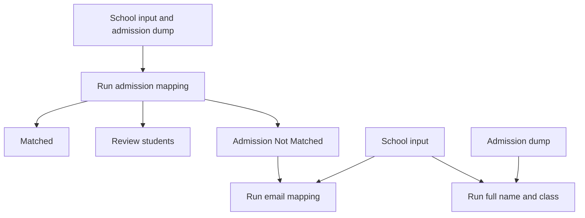
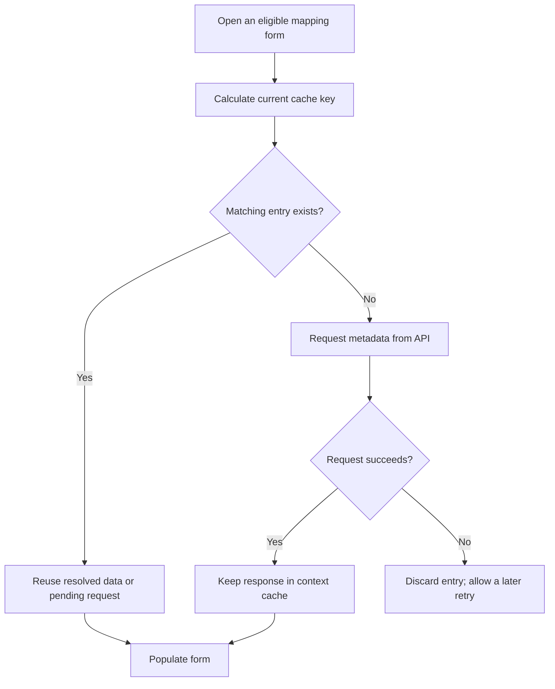

# Session, storage, API and React data flow

Terminology: **Review students** means students who need checking; **Preview screen**
means the screen used to view any result group. The app's exact status value remains
`Review`; API paths, filenames and code identifiers retain their original names.


This guide describes the implemented Student Mapping app and the behavior discussed
during development. For detailed matching rules, see [MAPPING_WORKFLOW.md](MAPPING_WORKFLOW.md).
Paths below are relative to the repository root unless an absolute path is shown.

## 1. Where each kind of data lives

| Location | Contents | Survives browser refresh? |
|---|---|---|
| Browser session cookie | Backend session identifier | Yes, until expiry or deletion |
| React `WorkspaceContext`: `workspace` state | Session API summary: files, settings, counts, versions and progress | No; restored through the session API |
| React `WorkspaceContext`: `metadataCache` ref | Small metadata responses for mapping forms, plus shared pending requests | No; fetched again when needed |
| Individual React components | Draft selections, loading/error state and fetched Preview screen rows | No; lifecycle depends on the component |
| Browser `sessionStorage` | Selected Preview screen preferences such as page, search, worksheet and result group, through `useSessionValue` | Generally yes within the same tab |
| Backend `state.json` | Saved workflow settings, signatures, workspace ID, file metadata and snapshot references | Yes, provided backend storage is retained |
| Backend `.bin` snapshots | Uploaded file bytes and generated result workbook bytes | Yes, provided backend storage is retained |

The complete workflow is not stored in browser local storage. Preview screen preferences
in `sessionStorage` are separate from the React metadata cache and backend session.

The backend session identifier in the cookie is distinct from `workspace_id`, the
public identifier included in the summary. API session lookup uses the cookie.

## 2. What happens when the website loads

```mermaid
sequenceDiagram
    participant Browser
    participant React as WorkspaceProvider
    participant API as Backend API
    participant Disk as Session storage
    Browser->>React: Load application
    React->>React: workspace is empty; show loading screen
    React->>API: GET /api/v1/mapping/session (browser sends cookie)
    alt Valid existing session
        API->>Disk: Read state.json and resolve snapshot references
        API->>API: Build session summary
        API-->>React: Summary JSON
    else Missing or expired session (401 / 404)
        React->>API: POST /api/v1/mapping/session
        API->>Disk: Create session folder and state.json
        API-->>Browser: Set session cookie
        API-->>React: Empty workspace summary
    end
    React->>React: setWorkspace(summary)
    React-->>Browser: Render saved settings, progress or empty defaults
```

The API client uses `credentials: 'include'`, so the browser sends the session
cookie with requests. A new session starts empty; supplying a school index when
creating it does not automatically fetch a dump.

There is also a startup check for the `school` URL query parameter. If it is present
and differs from the restored dump's school index, the frontend creates a new
session. Other startup errors are shown with a Retry button rather than silently
creating a replacement session.

**The response is a summary derived from `state.json`, not the raw file.** It includes:

- `workspace_id` and file metadata, including versions and available worksheets.
- Saved settings and admission configuration.
- Counts and versions of exported result groups.
- Email readiness, committed mapping columns and pass/round progress.

The summary does not include all student rows. Table rows are requested separately.

## 3. Snapshot linking, updates and cleanup

Each workflow has one private folder under
`storage/temp/workflow_sessions/<session-id>/`:

```text
<session-id>/
├── state.json                         logical manifest
├── <sha256>.bin                       source snapshot
├── <sha256>.bin                       generated workbook snapshot
└── ...
```

### What a `.bin` contains

`.bin` is only a storage extension. Its bytes remain the original CSV/XLSX input,
SQL-generated CSV, or generated result workbook; it is not a custom database
format. The SHA-256 content hash becomes its filename, so identical bytes reuse
the existing snapshot while changed bytes create a new filename.

### How `state.json` gives snapshots meaning

The hash alone does not identify a file's role. `state.json` stores its original
name/metadata and links each logical source or result to a snapshot:

```text
state.json
├── saved_admission_school ─────────────→ <school-hash>.bin
├── saved_admission_dump ───────────────→ <dump-hash>.bin
└── admission_exports
    ├── matched.xlsx ───────────────────→ <matched-hash>.bin
    ├── review.xlsx ────────────────────→ <review-hash>.bin
    └── not_matched.xlsx ───────────────→ <not-matched-hash>.bin
```

Simplified manifest entry:

```json
{
  "saved_admission_dump": {
    "metadata": {
      "name": "school_914_dump.csv",
      "school_index": "914",
      "school_name": "Example School"
    },
    "file": "<sha256>.bin"
  }
}
```

### Updating, reusing and delinking

When bytes change, the backend writes the new snapshot first and atomically
replaces `state.json` so it points to the new hash. Unchanged files keep their
existing hashes; the session folder itself is not replaced.

```text
Before: matched.xlsx → hash-A.bin    review.xlsx → hash-B.bin
After:  matched.xlsx → hash-C.bin    review.xlsx → hash-B.bin
```

Invalidation or replacement **delinks** an old snapshot by removing/changing its
manifest reference. Delinking makes it inaccessible through the workflow but does
not immediately delete its `.bin`; unreferenced snapshots remain until the entire
session folder is removed after expiry. This is why files physically present in
the folder are not necessarily current workflow files.

### Loading, validation and search

To load data, the backend reads `state.json`, resolves the referenced hash inside
the same session folder, restores the original filename/metadata, and parses or
returns its bytes. Missing, malformed, or out-of-folder references return
`409 Conflict` so the frontend can start a clean session.

Search and pagination never create another snapshot:

```text
Original School/Dump .bin source snapshot
                 ↓
          Read into memory
                 ↓
   Apply query and selected columns
                 ↓
      Calculate requested page
                 ↓
       Return only that page
                 ↓
   Discard temporary filtered data
```

The browser remembers the query, selected columns, page, and page size and sends
them again. The backend rebuilds the filtered data temporarily for each request.

### Cleanup boundary

After 24 hours without activity, cleanup deletes the complete session folder:
`state.json`, referenced snapshots, and unreferenced snapshots together. Individual
delinked `.bin` files are not currently garbage-collected earlier.

## 4. How a user operation updates the app

For an operation such as upload, dump fetch or mapping:

1. The user clicks the operation button.
2. React sends the API request and shows the busy state.
3. The backend loads the session, performs the operation and updates its state.
4. Saved file bytes are written as snapshots. The manifest is written to
   `state.pending.json`, then replaces `state.json`.
5. The API returns the updated summary.
6. React calls `setWorkspace` with that summary and renders the updated page.

This is **backend first**, not an optimistic update of the saved workflow in React.
Local draft fields and loading indicators can change before the request completes.

### Consistency and atomicity

The manifest replacement protects readers from seeing a partly written JSON file.
The backend also uses a process-local lock around workflow access.

This does **not** make browser memory and disk one atomic transaction. If saving
succeeds but the response is lost, the browser can still show old data. The frontend
tries to reload the session after operation errors. Refreshing also reloads it.

The workspace context manager saves in a `finally` block. Therefore an endpoint
that mutates state before an error can persist those changes; there is no universal
rollback for all operations. SQL dump fetch avoids that risk by validating and
fetching first, then replacing the previous dump and admission exports only after
success. Admission mapping works on a copied state and commits it on success.

The lock is local to one backend process, not a lock shared by multiple servers.

## 5. School index after fetching a dump

`POST /api/v1/mapping/student-dump/fetch` receives the entered school index.
The repository validates the school name, then selects `users` for that school
with `user_type = '0'`. An inner `JOIN` to `paid_users` by `user_id` attaches admission
numbers and excludes students with no paid record. Multiple distinct admissions remain.
After a successful lookup it saves:

- The fetched dump and its school metadata when records exist.
- `admission_settings.admission_dump_school_index`.
- `admission_settings.admission_dump_source = "Fetch from SQL"`.

Database `NULL` cells are normalized to empty text. Rows that are completely
identical after this normalization are reduced to one retained record, so the
stored snapshot and displayed dump count do not include normalization duplicates.
This is not deduplication by student: **Dump records** and the fetch message count
rows, while **Students** counts distinct user IDs. Multiple admission numbers or
different missing-value representations can produce multiple rows per student.
See [SQL dump selection and counts](MAPPING_WORKFLOW.md#sql-dump-selection-and-counts)
for examples and the matching database count query.

Previously saved dumps retain their original bytes. Fetch again to apply the
current inner-join selection.

The form prefers the loaded SQL dump's index, falling back to the saved search
setting. This also repairs the displayed value for older sessions whose search
setting did not agree with their loaded dump.

Reload restores the last saved value. Typing another index without submitting it
does not change the saved search setting. A successful lookup with no records
saves the search setting but does not create a dump snapshot. An invalid index or
database failure does not replace the loaded dump, its school metadata, or its
existing admission results.

## 6. Independent mappings and page requirements



Admission, Email using the school-file source, and Full name + class can be started
without another mapping's results. Email may instead read Admission Not Matched;
that option requires Admission mapping to run first. Full name + class reads the
school file and admission dump directly. Changing the school file, dump, or school index
clears all results; Admission reruns clear Email and Class; Email reruns clear Class.

Changing school/dump contents invalidates admission results, requiring admission
mapping again. Identical uploaded bytes need not invalidate the results. A SQL
dump fetch explicitly clears the previous admission results. Draft dropdown edits
are distinct from committed settings: a configuration check does not itself
rerun mapping or replace saved results.

Rerunning Admission replaces Admission and clears Email/Class. Rerunning Email
replaces Email and clears Class. Rerunning Class replaces only Class. Source
signatures also invalidate stale dependent results. Invalidation does not run a mapping.

### Admission first-name check discussed during development

When an admission number occurs exactly once in the dump:

| Comparison | Result |
|---|---|
| School and dump first names differ | Review students with a mismatch reason |
| Names match and are longer than one character | Eligible for Matched, subject to existing checks |
| Names match but are a single character, including matching `A.` initials | Review students: first name matches but is only 1 character |
| A first name is missing | Review students with a missing-name reason |

Comparison trims outer spaces and ignores case. The initial-length check happens
after equality comparison: `A` and `A.` are still different names. Duplicate
admissions, missing usernames and account uniqueness checks continue to apply.
Single-character matches remain in Review; there is no admission second pass.

## 7. File and result Preview screen flow

| Preview screen | Endpoint after `/api/v1/mapping` | Backend route file |
|---|---|---|
| School, admission dump, email dump or a downstream source | `/table-previews/{kind}` | `source_files_preview.py` |
| Matched, Review students or Not Matched results | `/result-previews/{stage}/{filename}` | `mapping_preview_results.py` |

Examples of current URLs:

```text
GET /api/v1/mapping/table-previews/school?page=1&limit=50
GET /api/v1/mapping/table-previews/dump?page=1&limit=50
GET /api/v1/mapping/table-previews/email_dump?page=1&limit=50
GET /api/v1/mapping/result-previews/admission/matched.xlsx?page=1&limit=50
GET /api/v1/mapping/result-previews/admission/review.xlsx?page=1&limit=50
GET /api/v1/mapping/result-previews/admission/not_matched.xlsx?page=1&limit=50
```

The result endpoint still uses filenames. The simpler `/matched`, `/review` and
`/not-matched` path alternatives discussed earlier were not implemented.

For each Preview screen the backend:

1. Identifies the session from the cookie.
2. Resolves the selected file/result through `state.json`.
3. Reads the referenced `.bin` snapshot using its original format.
4. Applies any supported search and selects the requested page.
5. Returns JSON with `columns`, `rows`, `total`, `found`, `page`, `pages`, `offset`
   and `end`, plus endpoint-specific metadata.

The current backend reads the full saved file before selecting page rows.
Pagination reduces response size; it does not make the underlying file read a
page-only read. The session summary itself can also read files while calculating
configuration and versions.

School, admission dump and email dump Preview screens use positive page sizes,
with 50 rows by default and choices of 25, 50 or 100. Search covers the entire
selected worksheet before pagination, and changing the search resets to page 1.
School overview totals still represent the entire file. Downloads contain the
complete selected file/result, not just the visible page.

“Preview screen” means viewing data. **Review students** is a mapping result category.

## 8. What sidebar navigation requests

| Page | Metadata needed to prepare its form |
|---|---|
| Email mapping | School-file columns, total count, email/first-name suggestions and one sample row |
| Class concatenation | School-file metadata and admission dump metadata |

The metadata request uses `limit=1`. It is not an email or class mapping run.
Both mappings request only a one-row metadata preview rather than the complete file.

Relevant metadata URLs are:

```text
GET /api/v1/mapping/table-previews/school?limit=1
GET /api/v1/mapping/table-previews/dump?limit=1&sheet=<selected-sheet>
```

The dump request includes a sheet only when a value is available. Full Preview screen
tables and result Preview screens have their own requests; the metadata cache does not
cache all Preview screen pages or stop those requests.

## 9. React metadata cache

The cache is a `useRef` called `metadataCache` owned by `WorkspaceProvider`.
It is separate from the `workspace` state received from the backend. Each entry
contains its key, a shared promise, and the resolved response data.

| Entry | Used by | Key depends on |
|---|---|---|
| `school` | Email mapping and class concatenation | Workspace ID, school metadata/version and relevant saved column/worksheet settings |
| `dump` | Class concatenation | Workspace ID, dump metadata/version and saved settings |

The current dump key includes the whole settings object, so any saved setting
change can invalidate this entry even if the dump bytes did not change.



Changing keys removes old entries. An old request finishing later cannot overwrite
the current entry. Navigating away does not cancel a shared metadata request, so
returning while it is pending can reuse it.

An Admission rerun invalidates school-related metadata entries and increments the
local revision. A new workspace changes all keys. Refreshing the browser clears
every React cache entry.

This cache is local to the current page lifetime. There is no cross-tab push
synchronization: a change made elsewhere is detected when this tab receives an
updated workspace summary, such as on reload.

## 10. Reload, expiry and storage suitability

On refresh, React state and refs disappear. The cookie normally remains, so the
session API restores the summary from backend storage. Metadata is fetched lazily
when an eligible page needs it. Browser refresh does not delete backend files.

Backend sessions expire after **24 hours of inactivity**. Accessing a valid session,
including a read-only Preview screen, refreshes its activity timestamp. Expiry is checked
on access; creating a session also cleans up expired session folders.

The cookie has a **72-hour maximum age**. Cookie lifetime and backend inactivity
expiry are separate, so a cookie can still exist after its backend session expires.

The cookie is HttpOnly, SameSite=Lax and uses the configured Secure flag. Its name
is `__Host-student-mapping-session` in secure mode or `student_mapping_session`
otherwise. JavaScript does not need to read its value.

The current disk layout is suitable for local development and a single backend
with retained storage. A production deployment must preserve the storage directory
across restarts/deployments if sessions should survive. Multiple backend processes
or servers need coordinated storage/locking. This is expiring workflow storage,
not a permanent project archive.

## 11. How to inspect the data yourself

- **DevTools → Network:** reload and select `session`; Response shows the session
  summary. Filter `table-previews` to inspect metadata and source Preview screen responses.
  Headers shows the full URL, method and query parameters.
- **DevTools → Application → Cookies:** inspect the session cookie.
- **React Developer Tools → Components → WorkspaceProvider:** inspect the workspace
  state and the metadata cache ref. Components is provided by React Developer Tools;
  Redux DevTools alone does not provide it.
- **DevTools → Application → Session Storage:** inspect Preview screen preferences, not
  the backend manifest or context cache.
- **Backend disk:** open the session folder's `state.json` to see saved settings and
  snapshot references. No `state.json` file is stored in the browser.

Changing pages should reuse cached form metadata while its key is unchanged.
Refreshing the browser should cause metadata requests again when the forms load.

## 12. Code map

| Responsibility | File |
|---|---|
| Restore session endpoint | [get_session.py](../Backend/routes/file_workflow_routes/get_session.py) |
| Create session and set cookie | [set_session.py](../Backend/routes/file_workflow_routes/set_session.py) |
| Cookie validation and transport | [session_cookie.py](../Backend/api/session_cookie.py) |
| Session folder, locking and expiry | [file_workflow_state.py](../Backend/api/file_workflow_state.py) |
| Read/write manifest and snapshots | [file_workflow_session_storage.py](../Backend/api/file_workflow_session_storage.py) |
| Build session summary and paginated responses | [file_workflow_responses.py](../Backend/api/file_workflow_responses.py) |
| Input upload, SQL fetch and saved school details | [file_inputs.py](../Backend/routes/file_workflow_routes/file_inputs.py) |
| Source file Preview screens | [source_files_preview.py](../Backend/routes/file_workflow_routes/source_files_preview.py) |
| Mapping result Preview screens | [mapping_preview_results.py](../Backend/routes/file_workflow_routes/mapping_preview_results.py) |
| Draft configuration endpoint | [configuration_preview.py](../Backend/routes/file_workflow_routes/configuration_preview.py) |
| Admission endpoints | [admission_mapping.py](../Backend/routes/file_workflow_routes/admission_mapping.py) |
| Email endpoints | [email_mapping.py](../Backend/routes/file_workflow_routes/email_mapping.py) |
| Class concatenation endpoints | [full_name_class_mapping.py](../Backend/routes/file_workflow_routes/full_name_class_mapping.py) |
| Session restoration, operation handling and metadata cache | [WorkspaceContext.jsx](../frontend/src/context/WorkspaceContext.jsx) |
| HTTP client and cookie inclusion | [api.js](../frontend/src/services/api.js) |
| Email metadata consumer | [EmailMappingPage.jsx](../frontend/src/pages/EmailMapping/EmailMappingPage.jsx) |
| Class metadata consumers | [FullNameClassMappingPage.jsx](../frontend/src/pages/FullNameClassMapping/FullNameClassMappingPage.jsx) |
| Source viewer | [FileViewer.jsx](../frontend/src/components/common/FileViewer.jsx) |
| Result viewer | [ResultPreview.jsx](../frontend/src/components/common/ResultPreview.jsx) |
| Browser Preview screen preferences | [useSessionValue.js](../frontend/src/hooks/useSessionValue.js) |

API paths use `/api/v1` by default; the frontend and backend prefixes are configurable.
The two main run endpoints are `POST /mapping/email-mapping/run` and
`POST /mapping/full-name-class-mapping/run`, after that prefix. Admission runs use
`POST /mapping/admission-mapping/run`. Opening a page does not call these run endpoints.
